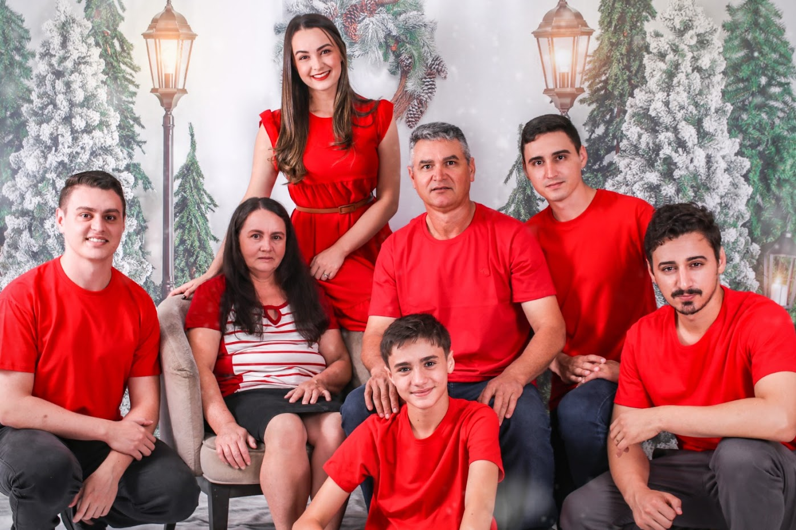

# Happy Birthday, Kalita 🎉

A heartfelt birthday web experience created as a 30th birthday gift.

## Motivation

This project was built as a gift for my sister’s 30th birthday.
The idea was to gather loving messages from close family and friends in one place, and also preserve important moments that marked each person’s relationship with her.

More than a website, this is a digital memory album full of affection, gratitude, and celebration.

## What you will find on the site

- **Personalized entry screen** where the visitor enters their name to unlock the surprise.
- **Warm welcome section** with a hero image and celebratory mood.
- **Felicitações (Congratulations) carousel** containing birthday messages from family and friends, each with a photo.
- **“Momentos marcantes” (Memorable moments) timeline-like gallery** with curated photo “post-its” and short captions.
- **Animated festive atmosphere** (confetti, soft transitions, playful visual style).
- **Persistent visitor greeting** shown in the top bar after login, with a logout action.

## Visual highlights

### Entry and surprise concept


### Celebration carousel (messages + portraits)


### Memorable moments gallery



## Technical implementation

This project is an **ASP.NET Core MVC** web application.

### Stack

- **.NET / ASP.NET Core MVC** for the web application structure.
- **Entity Framework Core** with **SQL Server** for data access.
- **Razor Views** for server-rendered UI.
- **Vanilla JavaScript** for interactions and animations.
- **Bootstrap + custom CSS** for responsive layout and visual identity.

### Architecture and flow

1. The app starts in `Program.cs`, configures MVC, dependency injection, and the database context.
2. On startup, `DatabaseInitializer` runs migrations and seeds messages when the database is empty.
3. `HomeController` handles:
   - `Entry` (GET/POST): validates name and stores it in a cookie.
   - `Index`: requires the visitor cookie and loads all birthday messages.
   - `Logout`: clears the cookie and returns to entry.
4. `FriendRepository` reads the seeded messages (`FriendModel`) and sends them to the main page.

### Front-end behavior

- **Confetti effect** generated continuously via JavaScript.
- **Custom carousel logic** with next/previous controls, indicators, and swipe support.
- **Dynamic post-it styling** (random colors and slight rotation) for the memorable moments section.
- **Animated focus on scroll** to emphasize the currently centered “post-it”.

## Running the project locally

### Prerequisites

- .NET SDK (compatible with the project)
- SQL Server / LocalDB available

### Steps

```bash
cd MyApp
dotnet restore
dotnet run
```

Then open the local URL shown in the terminal.

## Author

Made with love by **Gabriel Micael Henrique**.
